Last updated: 2015-08-29 19:45:31

``` r
require(dplyr)
require(tidyr)
require(ggplot2)
require(gridExtra)
require(survival)
require(broom)

theme_set(theme_bw())
palette(rainbow(6))
par(bty='n',las=1)

load("~/Dropbox/SyncBriefcase/LAB/IACS/BioBank/BioLincc-APOE/CARDIA/cardia-dataframesR/analisis/APOE-MetS/all.years/todasVariables.Rdata")
```

### Define nuevas variables

Engorde

``` r
dfw=select(df,apoe4=y00_apoe4,contains('BMI'))
dfw=gather(dfw,year,bmi,y00_A20BMI:y25_H20BMI)
dfw$year=substr(dfw$year,2,3)
ggplot(dfw,aes(y=bmi,x=year))+
  geom_boxplot()
```

    ## Warning: Removed 2976 rows containing non-finite values (stat_boxplot).

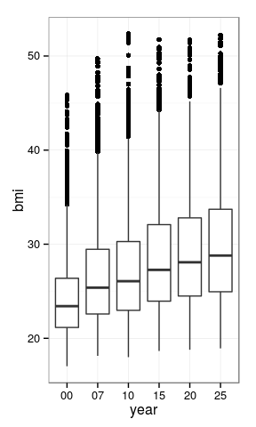

``` r
dfww=summarise(group_by(dfw,year),bmi=mean(bmi,na.rm=T))
with(dfww,cor.test(bmi,as.numeric(year)))
```

    ## 
    ##  Pearson's product-moment correlation
    ## 
    ## data:  bmi and as.numeric(year)
    ## t = 10.483, df = 4, p-value = 0.0004681
    ## alternative hypothesis: true correlation is not equal to 0
    ## 95 percent confidence interval:
    ##  0.8417481 0.9981423
    ## sample estimates:
    ##       cor 
    ## 0.9822825

Define la variable 'dosis de alelo E4'

``` r
df$e4[df$y00_DL5APOE%in%c('2/2','3/2','3/3')]='00'
df$e4[df$y00_DL5APOE%in%c('4/2','4/3')]='01'
df$e4[df$y00_DL5APOE%in%c('4/4')]='11'
df$e4=as.factor(df$e4)
```

Selección de variables a utilizar.

``` r
df=select(df,PID, apoe4=y00_apoe4,contains('BMI'),contains('_MetS'),
          RACE=y00_RACE,SEX=y00_SEX,e4,age0=y00_EXAMAGE,smoke0=y00_A10SMOKE)
df$apoe4=as.factor(df$apoe4)
```

categorias BMI

``` r
df$bmi0[df$y00_A20BMI<25]='Normal'
df$bmi0[df$y00_A20BMI>=25&df$y00_A20BMI<30]='Overweight'
df$bmi0[df$y00_A20BMI>=30]='Obese'
df$bmi0=factor(df$bmi0,levels=c('Normal','Overweight','Obese'))
```

calcula la primera ocurrencia de MetS

``` r
mat0=select(df,y00_MetS:y25_MetS)
mat0[is.na(mat0)]=0
mat0$year=ifelse(mat0$y00_MetS+mat0$y07_MetS+mat0$y10_MetS+mat0$y15_MetS+
                   mat0$y20_MetS+mat0$y25_MetS==0,-1,max.col(mat0,'first'))
```

calcula el BMIs asociado a la primera ocurrencia de MetS

``` r
df$yearOnset=mat0$year
f=function (x) { p=df[x,2+df$yearOnset[x]]
                  return(p)}
```

bmi al onset de MetS

``` r
df$bmiOnset=sapply(1:nrow(df),f)
df$bmiOnset[df$bmiOnset>100]=NA
```

tiempo de permanencia en la cohorte

``` r
year=select(df,y00_A20BMI:y25_H20BMI)
f2=function (c) {ifelse(!is.na(c[length(c)]),length(c),
                        ifelse(!is.na(c[length(c)-1]),length(c)-1,
                               ifelse(!is.na(c[length(c)-2]),length(c)-2,
                                      ifelse(!is.na(c[length(c)-3]),length(c)-3,
                                             ifelse(!is.na(c[length(c)-4]),length(c)-4,
                        min(which(is.na(c))-1))))))}

year$year=apply(year,1,f2)

df$yearsFollowed=year$year

fx=function (x) { p=df[x,2+df$yearsFollowed[x]]
                 return(p)}
```

bmi in the last follow-up point

``` r
df$bmiLast=sapply(1:nrow(df),fx)
```

bmi al evento o bmi en el punto de censura (si no ha habido evento)

``` r
df$bmi=ifelse(is.na(df$bmiOnset),df$bmiLast,df$bmiOnset)

df$bmiFin[df$bmi<25]='Normal'###Por categorias
df$bmiFin[df$bmi>=25&df$y00_A20BMI<30]='Overweight'
df$bmiFin[df$bmi>=30]='Obese'
df$bmiFin=factor(df$bmiFin,levels=c('Normal','Overweight','Obese'))
```

Categorias segun el grupo inicial (bmi0) y final (bmiFin)

``` r
df$change1[df$bmi0=='Normal'&df$bmiFin=='Normal']='NorNor'
df$change1[df$bmi0=='Normal'&df$bmiFin=='Overweight']='NorOver'
df$change1[df$bmi0=='Normal'&df$bmiFin=='Obese']='NorObes'
df$change1[df$bmi0=='Overweight'&df$bmiFin=='Overweight']='OverOver'
df$change1[df$bmi0=='Overweight'&df$bmiFin=='Obese']='OverObes'
df$change1[df$bmi0=='Obese'&df$bmiFin=='Obese']='ObesObes'
df$change1=factor(df$change1,levels=c("NorNor","NorOver","NorObes","OverOver","OverObes","ObesObes"))

df$change2[df$bmi0=='Normal'&df$bmiFin=='Normal']='Nor>Nor'
df$change2[df$bmi0=='Normal'&df$bmiFin%in%c('Overweight','Obese')]='Nor>Gordo'
df$change2[df$bmi0%in%c('Overweight','Obese')&df$bmiFin%in%c('Overweight','Obese')]='Gordo>Gordo'
df$change2=factor(df$change2,levels=c('Nor>Nor','Nor>Gordo','Gordo>Gordo'))
```

tiempo hasta el onset de MetS o tiempo de observacion sin evento

``` r
df$time=ifelse(df$yearOnset>0,df$yearOnset,df$yearsFollowed)
df$MetS=ifelse(df$yearOnset>0,1,0)
```

Incremento de BMI hasta el evento o censura

``` r
df$bmiInc=(1-df$y00_A20BMI/df$bmi)*100
df$bmiIncCat=cut(df$bmiInc,quantile(df$bmiInc,c(0,1/3,2/3,1),na.rm=T))
table(df$bmiIncCat,df$apoe4)
```

    ##               
    ##                 E4 no-E4
    ##   (-56.9,10.1] 387   911
    ##   (10.1,20.3]  396   903
    ##   (20.3,54.7]  396   903

slopes de los incrementos de BMI

``` r
vt=c(0,7,10,15,20,25)
ff=function (x) {coef(lm(as.numeric(x)~vt))[2]}
df$bmiSlope=apply(df[,3:8],1,ff)
df$bmiSlopeCat=cut(df$bmiSlope,quantile(df$bmiSlope,c(0,1/3,2/3,1),na.rm=T))
table(df$bmiSlopeCat,df$apoe4)
```

    ##                
    ##                  E4 no-E4
    ##   (-0.988,0.13] 370   929
    ##   (0.13,0.292]  398   902
    ##   (0.292,2.14]  411   889

``` r
###########################################################
df$times[df$time==1]=0
df$times[df$time==2]=7
df$times[df$time==3]=10
df$times[df$time==4]=15
df$times[df$time==5]=20
df$times[df$time==6]=25
##########################################################
df$ageOnset=df$age0+df$times
##########################################################
##cargar datos hasta aqui
##########################################################
#####################################################################
```

### Varones blancos CON MetS

``` r
wasp=filter(df,RACE==5,SEX==1,MetS==1)##SOLO LOS QUE TIENEN MetS
summarise(group_by(wasp,e4),
          n=sum(!is.na(bmi)),average_BMI=mean(bmi,na.rm=T),median_BMI=median(bmi,na.rm=T))
```

    ## Source: local data frame [3 x 4]
    ## 
    ##   e4   n average_BMI median_BMI
    ## 1 00 295    30.84099   30.89531
    ## 2 01  81    30.99510   30.51416
    ## 3 11   4    30.50758   28.83855

``` r
plot1=ggplot(wasp,(aes(bmi,linetype=e4)))+##### kernel density plots
  geom_density(na.rm=T,adjust=1.1,size=1.5)
plot2=ggplot(wasp,(aes(bmi,linetype=apoe4)))+
  geom_density(size=1.5,adjust=1.1)
grid.arrange(plot1, plot2, ncol=2)
```

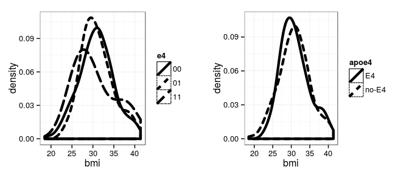

``` r
##Komolgorov-Smirnov Test
ks.test(wasp$bmi[wasp$e4=='00'],wasp$bmi[wasp$e4=='01'],alternative = 'less')
```

    ## Warning in ks.test(wasp$bmi[wasp$e4 == "00"], wasp$bmi[wasp$e4 == "01"], :
    ## p-value will be approximate in the presence of ties

    ## 
    ##  Two-sample Kolmogorov-Smirnov test
    ## 
    ## data:  wasp$bmi[wasp$e4 == "00"] and wasp$bmi[wasp$e4 == "01"]
    ## D^- = 0.068383, p-value = 0.5519
    ## alternative hypothesis: the CDF of x lies below that of y

``` r
d00=density(wasp$bmi[wasp$e4=='00'])
plot(ecdf(wasp$bmi[wasp$apoe4=='E4']),verticals = T,do.points=F,xlim=c(25,40),
     main='Cumulative density plot')####comulative density plot
lines(ecdf(wasp$bmi[wasp$apoe4=='no-E4']),verticals = T,do.points=F,lty=2)
```

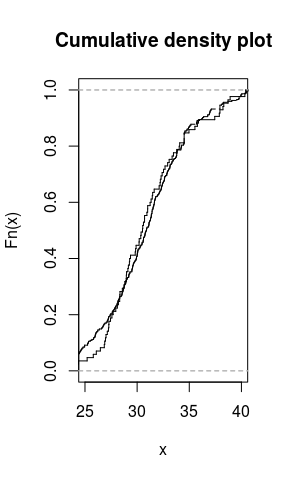

``` r
t.test(wasp$bmi~wasp$apoe4)
```

    ## 
    ##  Welch Two Sample t-test
    ## 
    ## data:  wasp$bmi by wasp$apoe4
    ## t = 0.27323, df = 146.35, p-value = 0.7851
    ## alternative hypothesis: true difference in means is not equal to 0
    ## 95 percent confidence interval:
    ##  -0.817552  1.079876
    ## sample estimates:
    ##    mean in group E4 mean in group no-E4 
    ##            30.97215            30.84099

``` r
ks.test(wasp$bmi[wasp$apoe4=='E4'],wasp$bmi[wasp$apoe4=='no-E4'])
```

    ## Warning in ks.test(wasp$bmi[wasp$apoe4 == "E4"], wasp$bmi[wasp$apoe4 == :
    ## p-value will be approximate in the presence of ties

    ## 
    ##  Two-sample Kolmogorov-Smirnov test
    ## 
    ## data:  wasp$bmi[wasp$apoe4 == "E4"] and wasp$bmi[wasp$apoe4 == "no-E4"]
    ## D = 0.083749, p-value = 0.7437
    ## alternative hypothesis: two-sided

ANALISIS DE SUPERVIVENCIA
=========================

En funcion del tiempo de follow-up
----------------------------------

### Toda la poblacion (n=3897)

*Edad al inicio del estudio se utiliza como covariable de todas las regresiones de Cox*

``` r
par(mfrow=c(1,2))
surv=Surv(df$times,df$MetS)
km=survfit(surv~df$e4)
#summary(km)
plot(km,lty=3:1,ylim=c(0.3,1),mark.time = F)
legend('bottomleft',c('00','01','11'),lty=3:1)
plot(km,lty=3:1,ylim=c(0,0.6),mark.time = F,fun='cumhaz')
legend('topleft',c('00','01','11'),lty=3:1)
```

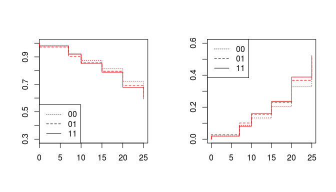

``` r
cox=coxph(surv~df$e4+df$age0)
summary(cox)
```

    ## Call:
    ## coxph(formula = surv ~ df$e4 + df$age0)
    ## 
    ##   n= 3908, number of events= 1337 
    ## 
    ##             coef exp(coef) se(coef)     z Pr(>|z|)    
    ## df$e401 0.115234  1.122136 0.060644 1.900   0.0574 .  
    ## df$e411 0.124972  1.133117 0.165573 0.755   0.4504    
    ## df$age0 0.051634  1.052990 0.007965 6.482 9.02e-11 ***
    ## ---
    ## Signif. codes:  0 '***' 0.001 '**' 0.01 '*' 0.05 '.' 0.1 ' ' 1
    ## 
    ##         exp(coef) exp(-coef) lower .95 upper .95
    ## df$e401     1.122     0.8912    0.9964     1.264
    ## df$e411     1.133     0.8825    0.8191     1.568
    ## df$age0     1.053     0.9497    1.0367     1.070
    ## 
    ## Concordance= 0.563  (se = 0.009 )
    ## Rsquare= 0.012   (max possible= 0.996 )
    ## Likelihood ratio test= 46.45  on 3 df,   p=4.541e-10
    ## Wald test            = 45.33  on 3 df,   p=7.874e-10
    ## Score (logrank) test = 45.59  on 3 df,   p=6.925e-10

``` r
survdiff(surv~df$e4,rho=0)#rho=0~log-rank or Mantel-Haenszel test
```

    ## Call:
    ## survdiff(formula = surv ~ df$e4, rho = 0)
    ## 
    ##             N Observed Expected (O-E)^2/E (O-E)^2/V
    ## df$e4=00 2725      911      940     0.894     3.307
    ## df$e4=01 1081      388      362     1.861     2.801
    ## df$e4=11  102       38       35     0.264     0.298
    ## 
    ##  Chisq= 3.3  on 2 degrees of freedom, p= 0.191

``` r
par(mfrow=c(1,2))
surv=Surv(df$times,df$MetS)
km=survfit(surv~df$apoe4)
#summary(km)
plot(km,lty=2:1,ylim=c(0.5,1),mark.time = F)
legend('bottomleft',c('E4','no-E4'),lty=2:1)
plot(km,lty=2:1,ylim=c(0,0.6),mark.time = F,fun='cumhaz',las=1)
legend('topleft',c('E4','no-E4'),lty=2:1,bty='n')
```

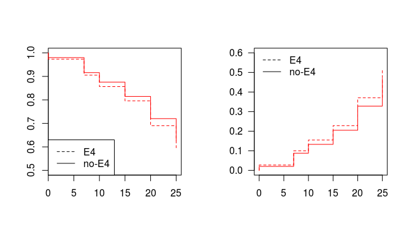

``` r
cox=coxph(surv~relevel(df$apoe4,ref='no-E4')+df$age0)
summary(cox)
```

    ## Call:
    ## coxph(formula = surv ~ relevel(df$apoe4, ref = "no-E4") + df$age0)
    ## 
    ##   n= 3908, number of events= 1337 
    ## 
    ##                                        coef exp(coef) se(coef)     z
    ## relevel(df$apoe4, ref = "no-E4")E4 0.116099  1.123108 0.058716 1.977
    ## df$age0                            0.051636  1.052992 0.007965 6.483
    ##                                    Pr(>|z|)    
    ## relevel(df$apoe4, ref = "no-E4")E4    0.048 *  
    ## df$age0                               9e-11 ***
    ## ---
    ## Signif. codes:  0 '***' 0.001 '**' 0.01 '*' 0.05 '.' 0.1 ' ' 1
    ## 
    ##                                    exp(coef) exp(-coef) lower .95
    ## relevel(df$apoe4, ref = "no-E4")E4     1.123     0.8904     1.001
    ## df$age0                                1.053     0.9497     1.037
    ##                                    upper .95
    ## relevel(df$apoe4, ref = "no-E4")E4      1.26
    ## df$age0                                 1.07
    ## 
    ## Concordance= 0.563  (se = 0.009 )
    ## Rsquare= 0.012   (max possible= 0.996 )
    ## Likelihood ratio test= 46.45  on 2 df,   p=8.191e-11
    ## Wald test            = 45.33  on 2 df,   p=1.438e-10
    ## Score (logrank) test = 45.59  on 2 df,   p=1.261e-10

``` r
survdiff(surv~df$apoe4,rho=0)
```

    ## Call:
    ## survdiff(formula = surv ~ df$apoe4, rho = 0)
    ## 
    ##                   N Observed Expected (O-E)^2/E (O-E)^2/V
    ## df$apoe4=E4    1183      426      397     2.118      3.31
    ## df$apoe4=no-E4 2725      911      940     0.894      3.31
    ## 
    ##  Chisq= 3.3  on 1 degrees of freedom, p= 0.069

En funcion de la categoria inicial (y00) de BMI

``` r
par(mfrow=c(2,3))
sapply(levels(df$bmi0),function (x){ 
  dfx=filter(df,bmi0==x)
  surv2=Surv(dfx$times,dfx$MetS)
  km2=survfit(surv2~dfx$apoe4)##start.time=20,type='kaplan')
  plot(km2,lty=2:1,xlab='follow-up (year)',ylim=c(0,1),main=x,mark.time = F)
  legend('bottomleft',c('E4','no-E4'),lty=2:1)
  cox=list(coxph(surv2~relevel(dfx$apoe4,ref='no-E4')+dfx$age0))
})
```

    ## $Normal
    ## Call:
    ## coxph(formula = surv2 ~ relevel(dfx$apoe4, ref = "no-E4") + dfx$age0)
    ## 
    ## 
    ##                                       coef exp(coef) se(coef)    z      p
    ## relevel(dfx$apoe4, ref = "no-E4")E4 0.0951    1.0998   0.0931 1.02 0.3070
    ## dfx$age0                            0.0324    1.0329   0.0122 2.66 0.0078
    ## 
    ## Likelihood ratio test=8.07  on 2 df, p=0.0177
    ## n= 2561, number of events= 549 
    ## 
    ## $Overweight
    ## Call:
    ## coxph(formula = surv2 ~ relevel(dfx$apoe4, ref = "no-E4") + dfx$age0)
    ## 
    ## 
    ##                                        coef exp(coef) se(coef)     z     p
    ## relevel(dfx$apoe4, ref = "no-E4")E4 -0.0133    0.9868   0.1008 -0.13 0.895
    ## dfx$age0                             0.0329    1.0334   0.0139  2.36 0.018
    ## 
    ## Likelihood ratio test=5.77  on 2 df, p=0.0559
    ## n= 896, number of events= 452 
    ## 
    ## $Obese
    ## Call:
    ## coxph(formula = surv2 ~ relevel(dfx$apoe4, ref = "no-E4") + dfx$age0)
    ## 
    ## 
    ##                                       coef exp(coef) se(coef)    z      p
    ## relevel(dfx$apoe4, ref = "no-E4")E4 0.0355    1.0361   0.1155 0.31 0.7585
    ## dfx$age0                            0.0506    1.0519   0.0163 3.11 0.0019
    ## 
    ## Likelihood ratio test=10.1  on 2 df, p=0.00627
    ## n= 440, number of events= 332

``` r
sapply(levels(df$bmi0),function (x){ 
  dfx=filter(df,bmi0==x)
  surv2=Surv(dfx$times,dfx$MetS)
  km2=survfit(surv2~dfx$apoe4)##start.time=20,type='kaplan')
  plot(km2,lty=2:1,xlab='follow-up (year)',ylim=c(0,1),main=x,mark.time = F,fun='cumhaz')
  legend('topleft',c('E4','no-E4'),lty=2:1)
  
})
```

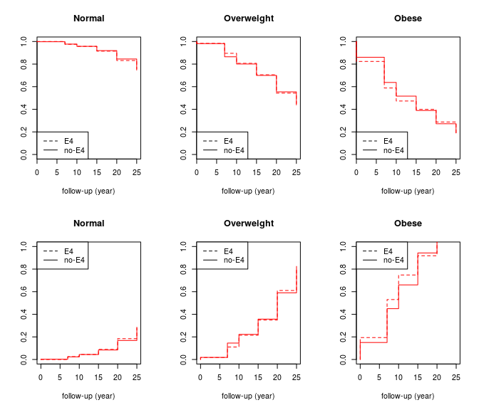

    ##      Normal Overweight Obese 
    ## rect List,4 List,4     List,4
    ## text List,2 List,2     List,2

en funcion del cambio de categoria de BMI

TODOS LOS INDIVIDUOS

``` r
par(mfrow=c(1,2))

surv=Surv(df$times,df$MetS)
km=survfit(surv~df$change1)
plot(km,col=df$change1,mark.time = F)
legend('bottomleft',levels(df$change1),lty=1,col=df$change1)
cox=coxph(surv~df$change1+df$age0)
summary(cox)
```

    ## Call:
    ## coxph(formula = surv ~ df$change1 + df$age0)
    ## 
    ##   n= 3852, number of events= 1328 
    ##    (56 observations deleted due to missingness)
    ## 
    ##                         coef exp(coef)  se(coef)      z Pr(>|z|)    
    ## df$change1NorOver   1.362479  3.905863  0.145089  9.391  < 2e-16 ***
    ## df$change1NorObes   2.265623  9.637122  0.141879 15.969  < 2e-16 ***
    ## df$change1OverOver  1.848908  6.352877  0.171506 10.780  < 2e-16 ***
    ## df$change1OverObes  2.663007 14.339347  0.138263 19.260  < 2e-16 ***
    ## df$change1ObesObes  3.377439 29.295651  0.140024 24.120  < 2e-16 ***
    ## df$age0             0.047939  1.049107  0.007949  6.031 1.63e-09 ***
    ## ---
    ## Signif. codes:  0 '***' 0.001 '**' 0.01 '*' 0.05 '.' 0.1 ' ' 1
    ## 
    ##                    exp(coef) exp(-coef) lower .95 upper .95
    ## df$change1NorOver      3.906    0.25603     2.939     5.191
    ## df$change1NorObes      9.637    0.10377     7.298    12.727
    ## df$change1OverOver     6.353    0.15741     4.539     8.891
    ## df$change1OverObes    14.339    0.06974    10.936    18.803
    ## df$change1ObesObes    29.296    0.03413    22.265    38.547
    ## df$age0                1.049    0.95319     1.033     1.066
    ## 
    ## Concordance= 0.78  (se = 0.009 )
    ## Rsquare= 0.273   (max possible= 0.996 )
    ## Likelihood ratio test= 1226  on 6 df,   p=0
    ## Wald test            = 984.2  on 6 df,   p=0
    ## Score (logrank) test = 1453  on 6 df,   p=0

``` r
km=survfit(surv~df$change2)
plot(km,col=df$change2,mark.time = F)
legend('bottomleft',levels(df$change2),lty=1,col=df$change2)
```

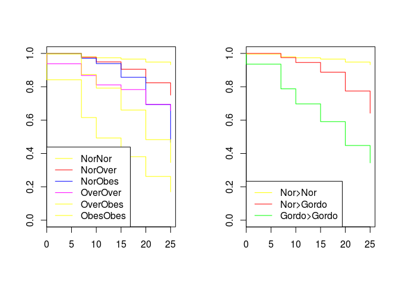

``` r
cox=coxph(surv~df$change2+df$age0)
summary(cox)
```

    ## Call:
    ## coxph(formula = surv ~ df$change2 + df$age0)
    ## 
    ##   n= 3852, number of events= 1328 
    ##    (56 observations deleted due to missingness)
    ## 
    ##                            coef exp(coef)  se(coef)      z Pr(>|z|)    
    ## df$change2Nor>Gordo    1.761586  5.821663  0.135879 12.964  < 2e-16 ***
    ## df$change2Gordo>Gordo  2.748605 15.620821  0.133152 20.643  < 2e-16 ***
    ## df$age0                0.042351  1.043261  0.007984  5.305 1.13e-07 ***
    ## ---
    ## Signif. codes:  0 '***' 0.001 '**' 0.01 '*' 0.05 '.' 0.1 ' ' 1
    ## 
    ##                       exp(coef) exp(-coef) lower .95 upper .95
    ## df$change2Nor>Gordo       5.822    0.17177     4.461     7.598
    ## df$change2Gordo>Gordo    15.621    0.06402    12.033    20.279
    ## df$age0                   1.043    0.95853     1.027     1.060
    ## 
    ## Concordance= 0.748  (se = 0.009 )
    ## Rsquare= 0.216   (max possible= 0.996 )
    ## Likelihood ratio test= 934.9  on 3 df,   p=0
    ## Wald test            = 659.2  on 3 df,   p=0
    ## Score (logrank) test = 919.4  on 3 df,   p=0

POR GENOTIPO

``` r
par(mfrow=c(1,3))
sapply(levels(df$change1),function (x){ 
  dfx=filter(df,change1==x)
  surv2=Surv(dfx$times,dfx$MetS)
  km2=survfit(surv2~dfx$apoe4)##start.time=20,type='kaplan')
  plot(km2,lty=2:1,xlab='follow-up (year)',ylim=c(0,1),main=x,mark.time = F)
  legend('bottomleft',c('E4','no-E4'),lty=2:1)
  cox=list(coxph(surv2~relevel(dfx$apoe4,ref='no-E4')+dfx$age0))
})
```

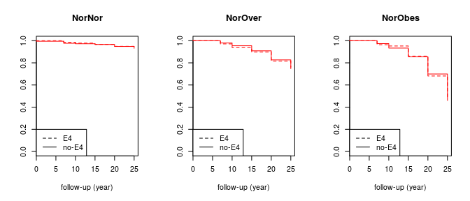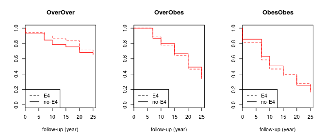

    ## $NorNor
    ## Call:
    ## coxph(formula = surv2 ~ relevel(dfx$apoe4, ref = "no-E4") + dfx$age0)
    ## 
    ## 
    ##                                        coef exp(coef) se(coef)     z
    ## relevel(dfx$apoe4, ref = "no-E4")E4 -0.0333    0.9673   0.2912 -0.11
    ## dfx$age0                             0.1207    1.1282   0.0414  2.91
    ##                                          p
    ## relevel(dfx$apoe4, ref = "no-E4")E4 0.9090
    ## dfx$age0                            0.0036
    ## 
    ## Likelihood ratio test=9.39  on 2 df, p=0.00913
    ## n= 1056, number of events= 61 
    ## 
    ## $NorOver
    ## Call:
    ## coxph(formula = surv2 ~ relevel(dfx$apoe4, ref = "no-E4") + dfx$age0)
    ## 
    ## 
    ##                                       coef exp(coef) se(coef)    z       p
    ## relevel(dfx$apoe4, ref = "no-E4")E4 0.1826    1.2004   0.1480 1.23    0.22
    ## dfx$age0                            0.0905    1.0947   0.0207 4.38 1.2e-05
    ## 
    ## Likelihood ratio test=21.4  on 2 df, p=2.25e-05
    ## n= 962, number of events= 215 
    ## 
    ## $NorObes
    ## Call:
    ## coxph(formula = surv2 ~ relevel(dfx$apoe4, ref = "no-E4") + dfx$age0)
    ## 
    ## 
    ##                                        coef exp(coef) se(coef)     z    p
    ## relevel(dfx$apoe4, ref = "no-E4")E4 -0.0399    0.9609   0.1316 -0.30 0.76
    ## dfx$age0                             0.0240    1.0243   0.0163  1.47 0.14
    ## 
    ## Likelihood ratio test=2.26  on 2 df, p=0.323
    ## n= 543, number of events= 273 
    ## 
    ## $OverOver
    ## Call:
    ## coxph(formula = surv2 ~ relevel(dfx$apoe4, ref = "no-E4") + dfx$age0)
    ## 
    ## 
    ##                                        coef exp(coef) se(coef)     z     p
    ## relevel(dfx$apoe4, ref = "no-E4")E4 -0.0277    0.9727   0.2424 -0.11 0.909
    ## dfx$age0                             0.0961    1.1008   0.0401  2.39 0.017
    ## 
    ## Likelihood ratio test=6.33  on 2 df, p=0.0422
    ## n= 257, number of events= 77 
    ## 
    ## $OverObes
    ## Call:
    ## coxph(formula = surv2 ~ relevel(dfx$apoe4, ref = "no-E4") + dfx$age0)
    ## 
    ## 
    ##                                        coef exp(coef) se(coef)    z     p
    ## relevel(dfx$apoe4, ref = "no-E4")E4 0.00533   1.00535  0.11092 0.05 0.962
    ## dfx$age0                            0.03401   1.03460  0.01474 2.31 0.021
    ## 
    ## Likelihood ratio test=5.41  on 2 df, p=0.0667
    ## n= 610, number of events= 374 
    ## 
    ## $ObesObes
    ## Call:
    ## coxph(formula = surv2 ~ relevel(dfx$apoe4, ref = "no-E4") + dfx$age0)
    ## 
    ## 
    ##                                       coef exp(coef) se(coef)    z     p
    ## relevel(dfx$apoe4, ref = "no-E4")E4 0.0217    1.0219   0.1163 0.19 0.852
    ## dfx$age0                            0.0409    1.0417   0.0162 2.52 0.012
    ## 
    ## Likelihood ratio test=6.6  on 2 df, p=0.0368
    ## n= 424, number of events= 328

``` r
par(mfrow=c(1,3))
sapply(levels(df$change2),function (x){ 
  dfx=filter(df,change2==x)
  surv2=Surv(dfx$times,dfx$MetS)
  km2=survfit(surv2~dfx$apoe4)##start.time=20,type='kaplan')
  plot(km2,lty=2:1,xlab='follow-up (year)',ylim=c(0,1),main=x,mark.time = F)
  legend('bottomleft',c('E4','no-E4'),lty=2:1)
  cox=list(coxph(surv2~relevel(dfx$apoe4,ref='no-E4')+dfx$age0))
})
```

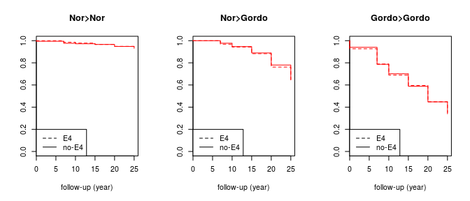

    ## $`Nor>Nor`
    ## Call:
    ## coxph(formula = surv2 ~ relevel(dfx$apoe4, ref = "no-E4") + dfx$age0)
    ## 
    ## 
    ##                                        coef exp(coef) se(coef)     z
    ## relevel(dfx$apoe4, ref = "no-E4")E4 -0.0333    0.9673   0.2912 -0.11
    ## dfx$age0                             0.1207    1.1282   0.0414  2.91
    ##                                          p
    ## relevel(dfx$apoe4, ref = "no-E4")E4 0.9090
    ## dfx$age0                            0.0036
    ## 
    ## Likelihood ratio test=9.39  on 2 df, p=0.00913
    ## n= 1056, number of events= 61 
    ## 
    ## $`Nor>Gordo`
    ## Call:
    ## coxph(formula = surv2 ~ relevel(dfx$apoe4, ref = "no-E4") + dfx$age0)
    ## 
    ## 
    ##                                       coef exp(coef) se(coef)    z      p
    ## relevel(dfx$apoe4, ref = "no-E4")E4 0.0953    1.1000   0.0983 0.97 0.3324
    ## dfx$age0                            0.0383    1.0391   0.0127 3.01 0.0026
    ## 
    ## Likelihood ratio test=10.1  on 2 df, p=0.00656
    ## n= 1505, number of events= 488 
    ## 
    ## $`Gordo>Gordo`
    ## Call:
    ## coxph(formula = surv2 ~ relevel(dfx$apoe4, ref = "no-E4") + dfx$age0)
    ## 
    ## 
    ##                                         coef exp(coef) se(coef)     z
    ## relevel(dfx$apoe4, ref = "no-E4")E4 -0.00365   0.99636  0.07612 -0.05
    ## dfx$age0                             0.03924   1.04002  0.01060  3.70
    ##                                           p
    ## relevel(dfx$apoe4, ref = "no-E4")E4 0.96176
    ## dfx$age0                            0.00021
    ## 
    ## Likelihood ratio test=14.1  on 2 df, p=0.000878
    ## n= 1291, number of events= 779

en funcion del tercil de incremento de BMI (% de cambio)

``` r
par(mfrow=c(1,3))
sapply(levels(df$bmiIncCat),function (x){ 
  dfx=filter(df,bmiIncCat==x)
  surv2=Surv(dfx$times,dfx$MetS)
  km2=survfit(surv2~dfx$apoe4)##start.time=20,type='kaplan')
  plot(km2,lty=2:1,xlab='exam year at onset',ylim=c(0,1),main=x,mark.time = F)
  legend('bottomleft',c('E4','no-E4'),lty=2:1)
  cox=list(coxph(surv2~relevel(dfx$apoe4,ref='no-E4')+dfx$age0))
})
```

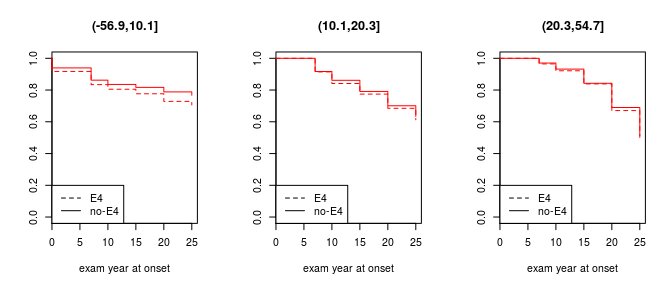

    ## $`(-56.9,10.1]`
    ## Call:
    ## coxph(formula = surv2 ~ relevel(dfx$apoe4, ref = "no-E4") + dfx$age0)
    ## 
    ## 
    ##                                       coef exp(coef) se(coef)    z       p
    ## relevel(dfx$apoe4, ref = "no-E4")E4 0.3033    1.3543   0.1220 2.49   0.013
    ## dfx$age0                            0.1382    1.1482   0.0201 6.88 5.8e-12
    ## 
    ## Likelihood ratio test=57.5  on 2 df, p=3.26e-13
    ## n= 1298, number of events= 297 
    ## 
    ## $`(10.1,20.3]`
    ## Call:
    ## coxph(formula = surv2 ~ relevel(dfx$apoe4, ref = "no-E4") + dfx$age0)
    ## 
    ## 
    ##                                       coef exp(coef) se(coef)    z       p
    ## relevel(dfx$apoe4, ref = "no-E4")E4 0.0997    1.1048   0.1027 0.97    0.33
    ## dfx$age0                            0.0752    1.0781   0.0145 5.17 2.3e-07
    ## 
    ## Likelihood ratio test=28.7  on 2 df, p=5.79e-07
    ## n= 1299, number of events= 442 
    ## 
    ## $`(20.3,54.7]`
    ## Call:
    ## coxph(formula = surv2 ~ relevel(dfx$apoe4, ref = "no-E4") + dfx$age0)
    ## 
    ## 
    ##                                       coef exp(coef) se(coef)    z      p
    ## relevel(dfx$apoe4, ref = "no-E4")E4 0.0345    1.0351   0.0886 0.39 0.6973
    ## dfx$age0                            0.0290    1.0295   0.0112 2.60 0.0092
    ## 
    ## Likelihood ratio test=7.01  on 2 df, p=0.03
    ## n= 1299, number of events= 594

en funcion de la mediana de incremento de BMI

``` r
df$bmiIncCat=cut(df$bmiInc,quantile(df$bmiInc,c(0,1/2,1),na.rm=T))
par(mfrow=c(1,2),las=1)
sapply(levels(df$bmiIncCat),function (x){ 
  dfx=filter(df,bmiIncCat==x)
  surv2=Surv(dfx$times,dfx$MetS)
  km2=survfit(surv2~dfx$apoe4)##start.time=20,type='kaplan')
  plot(km2,lty=2:1,xlab='follow-up years',ylim=c(0,0.7),main=x,mark.time = F,fun='cumhaz')
  legend('left',c('E4','no-E4'),lty=2:1,bty='n')
  cox=list(coxph(surv2~relevel(dfx$apoe4,ref='no-E4')+dfx$age0))
})
```

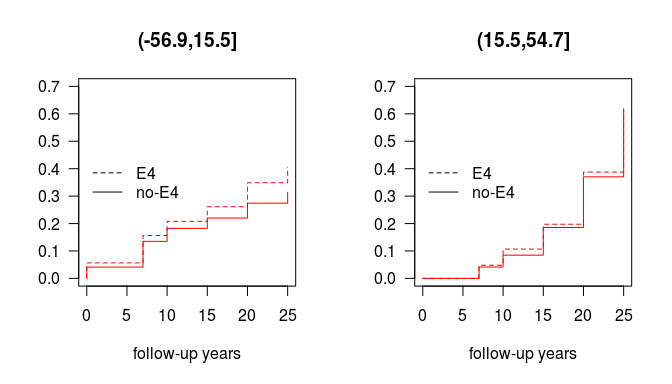

    ## $`(-56.9,15.5]`
    ## Call:
    ## coxph(formula = surv2 ~ relevel(dfx$apoe4, ref = "no-E4") + dfx$age0)
    ## 
    ## 
    ##                                       coef exp(coef) se(coef)    z       p
    ## relevel(dfx$apoe4, ref = "no-E4")E4 0.2540    1.2892   0.0935 2.72  0.0066
    ## dfx$age0                            0.1069    1.1129   0.0147 7.30 2.9e-13
    ## 
    ## Likelihood ratio test=64  on 2 df, p=1.29e-14
    ## n= 1948, number of events= 508 
    ## 
    ## $`(15.5,54.7]`
    ## Call:
    ## coxph(formula = surv2 ~ relevel(dfx$apoe4, ref = "no-E4") + dfx$age0)
    ## 
    ## 
    ##                                        coef exp(coef) se(coef)    z
    ## relevel(dfx$apoe4, ref = "no-E4")E4 0.02841   1.02881  0.07560 0.38
    ## dfx$age0                            0.03973   1.04053  0.00966 4.11
    ##                                           p
    ## relevel(dfx$apoe4, ref = "no-E4")E4    0.71
    ## dfx$age0                            3.9e-05
    ## 
    ## Likelihood ratio test=17.2  on 2 df, p=0.000182
    ## n= 1948, number of events= 825

en funcion de la mediana de incremento de BMI (solo incrementos positivos)

``` r
dfq=filter(df,bmiInc>0)
dfq$bmiIncCat=cut(dfq$bmiInc,quantile(dfq$bmiInc,c(0,1/2,1),na.rm=T))
par(mfrow=c(1,2))
sapply(levels(dfq$bmiIncCat),function (x){ 
  dfx=filter(dfq,bmiIncCat==x)
  surv2=Surv(dfx$times,dfx$MetS)
  km2=survfit(surv2~dfx$apoe4)##start.time=20,type='kaplan')
  plot(km2,lty=2:1,xlab='follow-up years',ylim=c(0.5,1),main=x,mark.time = F)
  legend('bottomleft',c('E4','no-E4'),lty=2:1)
  cox=list(coxph(surv2~relevel(dfx$apoe4,ref='no-E4')+dfx$age0))
})
```

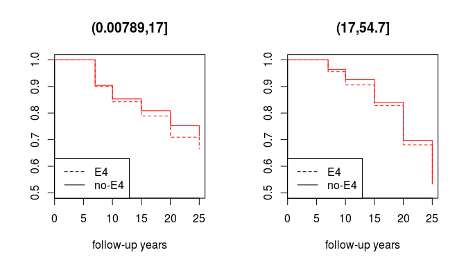

    ## $`(0.00789,17]`
    ## Call:
    ## coxph(formula = surv2 ~ relevel(dfx$apoe4, ref = "no-E4") + dfx$age0)
    ## 
    ## 
    ##                                       coef exp(coef) se(coef)    z       p
    ## relevel(dfx$apoe4, ref = "no-E4")E4 0.1917    1.2113   0.0985 1.95   0.052
    ## dfx$age0                            0.0834    1.0869   0.0148 5.64 1.7e-08
    ## 
    ## Likelihood ratio test=36.8  on 2 df, p=1.02e-08
    ## n= 1746, number of events= 470 
    ## 
    ## $`(17,54.7]`
    ## Call:
    ## coxph(formula = surv2 ~ relevel(dfx$apoe4, ref = "no-E4") + dfx$age0)
    ## 
    ## 
    ##                                       coef exp(coef) se(coef)    z       p
    ## relevel(dfx$apoe4, ref = "no-E4")E4 0.0400    1.0408   0.0791 0.51 0.61347
    ## dfx$age0                            0.0354    1.0360   0.0101 3.51 0.00045
    ## 
    ## Likelihood ratio test=12.7  on 2 df, p=0.00174
    ## n= 1746, number of events= 748

en funcion del tercil de slope de incremento de BMI

``` r
par(mfrow=c(1,3))
sapply(levels(df$bmiSlopeCat),function (x){ 
  dfx=filter(df,bmiSlopeCat==x)
  surv2=Surv(dfx$times,dfx$MetS)
  km2=survfit(surv2~dfx$apoe4)##start.time=20,type='kaplan')
  plot(km2,lty=2:1,xlab='exam year at onset',ylim=c(0,1),main=x,mark.time = F)
  legend('bottomleft',c('E4','no-E4'),lty=2:1)
  cox=list(coxph(surv2~relevel(dfx$apoe4,ref='no-E4')+dfx$age0))
})
```

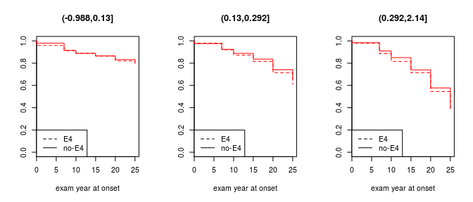

    ## $`(-0.988,0.13]`
    ## Call:
    ## coxph(formula = surv2 ~ relevel(dfx$apoe4, ref = "no-E4") + dfx$age0)
    ## 
    ## 
    ##                                       coef exp(coef) se(coef)    z       p
    ## relevel(dfx$apoe4, ref = "no-E4")E4 0.0973    1.1022   0.1425 0.68    0.49
    ## dfx$age0                            0.1122    1.1188   0.0217 5.16 2.5e-07
    ## 
    ## Likelihood ratio test=29.3  on 2 df, p=4.41e-07
    ## n= 1299, number of events= 237 
    ## 
    ## $`(0.13,0.292]`
    ## Call:
    ## coxph(formula = surv2 ~ relevel(dfx$apoe4, ref = "no-E4") + dfx$age0)
    ## 
    ## 
    ##                                       coef exp(coef) se(coef)    z       p
    ## relevel(dfx$apoe4, ref = "no-E4")E4 0.1483    1.1599   0.1028 1.44    0.15
    ## dfx$age0                            0.0931    1.0976   0.0148 6.29 3.1e-10
    ## 
    ## Likelihood ratio test=44.4  on 2 df, p=2.3e-10
    ## n= 1300, number of events= 426 
    ## 
    ## $`(0.292,2.14]`
    ## Call:
    ## coxph(formula = surv2 ~ relevel(dfx$apoe4, ref = "no-E4") + dfx$age0)
    ## 
    ## 
    ##                                       coef exp(coef) se(coef)    z     p
    ## relevel(dfx$apoe4, ref = "no-E4")E4 0.0600    1.0619   0.0829 0.72  0.47
    ## dfx$age0                            0.0528    1.0542   0.0106 4.99 6e-07
    ## 
    ## Likelihood ratio test=25.7  on 2 df, p=2.66e-06
    ## n= 1300, number of events= 673

### \*Solo varones blancos

``` r
df1=filter(df,RACE==5,SEX==1)
```

Incremento de BMI hasta el evento o censura

``` r
df1$bmiInc=(1-df1$y00_A20BMI/df1$bmi)*100
df1$bmiIncCat=cut(df1$bmiInc,quantile(df1$bmiInc,c(0,1/3,2/3,1),na.rm=T))
table(df1$bmiIncCat,df1$apoe4)
```

    ##               
    ##                 E4 no-E4
    ##   (-19.2,8.76]  89   235
    ##   (8.76,17.1]   77   248
    ##   (17.1,38.3]   70   255

slopes de los incrementos de BMI

``` r
vt=c(0,7,10,15,20,25)
ff=function (x) {coef(lm(as.numeric(x)~vt))[2]}
df1$bmiSlope=apply(df1[,3:8],1,ff)
df1$bmiSlopeCat=cut(df1$bmiSlope,quantile(df1$bmiSlope,c(0,1/3,2/3,1),na.rm=T))
table(df1$bmiSlopeCat,df1$apoe4)
```

    ##                 
    ##                   E4 no-E4
    ##   (-0.447,0.115]  83   242
    ##   (0.115,0.237]   84   241
    ##   (0.237,0.786]   68   258

``` r
surv=Surv(df1$times,df1$MetS)

km=survfit(surv~df1$apoe4)
summary(km)
```

    ## Call: survfit(formula = surv ~ df1$apoe4)
    ## 
    ##                 df1$apoe4=E4 
    ##  time n.risk n.event survival std.err lower 95% CI upper 95% CI
    ##     0    236       8    0.966  0.0118        0.943        0.989
    ##     7    228      19    0.886  0.0207        0.846        0.927
    ##    10    198      11    0.836  0.0243        0.790        0.885
    ##    15    181      16    0.762  0.0283        0.709        0.820
    ##    20    158      25    0.642  0.0325        0.581        0.709
    ##    25    121       6    0.610  0.0334        0.548        0.679
    ## 
    ##                 df1$apoe4=no-E4 
    ##  time n.risk n.event survival std.err lower 95% CI upper 95% CI
    ##     0    741      24    0.968  0.0065        0.955        0.980
    ##     7    717      56    0.892  0.0114        0.870        0.915
    ##    10    637      28    0.853  0.0131        0.828        0.879
    ##    15    591      48    0.784  0.0154        0.754        0.814
    ##    20    525      74    0.673  0.0178        0.639        0.709
    ##    25    414      65    0.567  0.0192        0.531        0.606

``` r
plot(km,lty=2:1,ylim=c(0.5,1),mark.time = F)
legend('bottomleft',c('E4','no-E4'),lty=2:1)
```

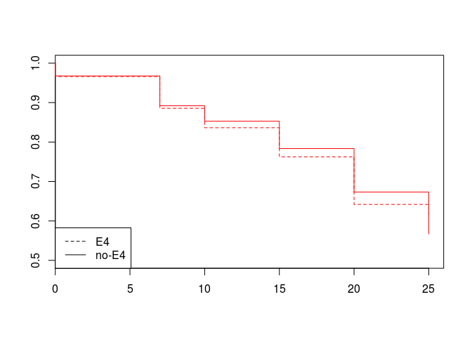

``` r
cox=coxph(surv~relevel(df1$apoe4,ref='no-E4')+df1$age0)
summary(cox)
```

    ## Call:
    ## coxph(formula = surv ~ relevel(df1$apoe4, ref = "no-E4") + df1$age0)
    ## 
    ##   n= 977, number of events= 380 
    ## 
    ##                                         coef exp(coef) se(coef)      z
    ## relevel(df1$apoe4, ref = "no-E4")E4 -0.04619   0.95486  0.12331 -0.375
    ## df1$age0                             0.04693   1.04805  0.01618  2.901
    ##                                     Pr(>|z|)   
    ## relevel(df1$apoe4, ref = "no-E4")E4  0.70798   
    ## df1$age0                             0.00372 **
    ## ---
    ## Signif. codes:  0 '***' 0.001 '**' 0.01 '*' 0.05 '.' 0.1 ' ' 1
    ## 
    ##                                     exp(coef) exp(-coef) lower .95
    ## relevel(df1$apoe4, ref = "no-E4")E4    0.9549     1.0473    0.7498
    ## df1$age0                               1.0481     0.9542    1.0153
    ##                                     upper .95
    ## relevel(df1$apoe4, ref = "no-E4")E4     1.216
    ## df1$age0                                1.082
    ## 
    ## Concordance= 0.552  (se = 0.017 )
    ## Rsquare= 0.009   (max possible= 0.994 )
    ## Likelihood ratio test= 8.96  on 2 df,   p=0.01131
    ## Wald test            = 8.71  on 2 df,   p=0.01284
    ## Score (logrank) test = 8.75  on 2 df,   p=0.01262

``` r
km2=survfit(surv~df1$e4)
summary(km2)
```

    ## Call: survfit(formula = surv ~ df1$e4)
    ## 
    ##                 df1$e4=00 
    ##  time n.risk n.event survival std.err lower 95% CI upper 95% CI
    ##     0    741      24    0.968  0.0065        0.955        0.980
    ##     7    717      56    0.892  0.0114        0.870        0.915
    ##    10    637      28    0.853  0.0131        0.828        0.879
    ##    15    591      48    0.784  0.0154        0.754        0.814
    ##    20    525      74    0.673  0.0178        0.639        0.709
    ##    25    414      65    0.567  0.0192        0.531        0.606
    ## 
    ##                 df1$e4=01 
    ##  time n.risk n.event survival std.err lower 95% CI upper 95% CI
    ##     0    227       8    0.965  0.0122        0.941        0.989
    ##     7    219      18    0.885  0.0211        0.845        0.928
    ##    10    190       9    0.844  0.0243        0.797        0.893
    ##    15    175      16    0.766  0.0287        0.712        0.825
    ##    20    152      24    0.645  0.0332        0.584        0.714
    ##    25    117       6    0.612  0.0341        0.549        0.683
    ## 
    ##                 df1$e4=11 
    ##  time n.risk n.event survival std.err lower 95% CI upper 95% CI
    ##     7      9       1    0.889   0.105        0.706        1.000
    ##    10      8       2    0.667   0.157        0.420        1.000
    ##    20      6       1    0.556   0.166        0.310        0.997

``` r
plot(km2,lty=3:1,mark.time = F)
legend('bottomleft',c('00','01','11'),lty=3:1)
```

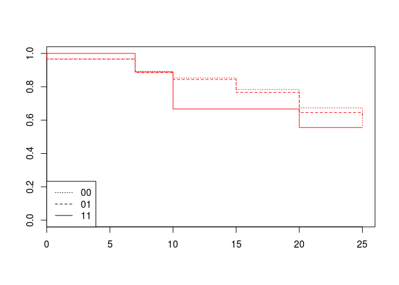

``` r
cox2=coxph(surv~relevel(df1$e4,ref='00')+df1$age0)
summary(cox2)
```

    ## Call:
    ## coxph(formula = surv ~ relevel(df1$e4, ref = "00") + df1$age0)
    ## 
    ##   n= 977, number of events= 380 
    ## 
    ##                                   coef exp(coef) se(coef)      z Pr(>|z|)
    ## relevel(df1$e4, ref = "00")01 -0.05436   0.94709  0.12571 -0.432  0.66543
    ## relevel(df1$e4, ref = "00")11  0.13251   1.14168  0.50369  0.263  0.79250
    ## df1$age0                       0.04667   1.04777  0.01619  2.883  0.00394
    ##                                 
    ## relevel(df1$e4, ref = "00")01   
    ## relevel(df1$e4, ref = "00")11   
    ## df1$age0                      **
    ## ---
    ## Signif. codes:  0 '***' 0.001 '**' 0.01 '*' 0.05 '.' 0.1 ' ' 1
    ## 
    ##                               exp(coef) exp(-coef) lower .95 upper .95
    ## relevel(df1$e4, ref = "00")01    0.9471     1.0559    0.7403     1.212
    ## relevel(df1$e4, ref = "00")11    1.1417     0.8759    0.4254     3.064
    ## df1$age0                         1.0478     0.9544    1.0150     1.082
    ## 
    ## Concordance= 0.55  (se = 0.017 )
    ## Rsquare= 0.009   (max possible= 0.994 )
    ## Likelihood ratio test= 9.09  on 3 df,   p=0.02813
    ## Wald test            = 8.85  on 3 df,   p=0.03138
    ## Score (logrank) test = 8.88  on 3 df,   p=0.03087

en funcion del tercil de incremento de BMI

``` r
par(mfrow=c(1,3))
sapply(levels(df1$bmiIncCat),function (x){ 
  dfx=filter(df1,bmiIncCat==x)
  surv2=Surv(dfx$times,dfx$MetS)
  km2=survfit(surv2~dfx$apoe4)##start.time=20,type='kaplan')
  plot(km2,lty=2:1,xlab='exam year at onset',ylim=c(0,1),main=x,mark.time = F)
  legend('bottomleft',c('E4','no-E4'),lty=2:1)
  cox=list(coxph(surv2~relevel(dfx$apoe4,ref='no-E4')+dfx$age0))
})
```

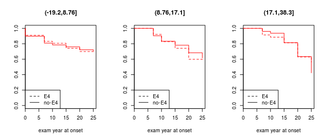

    ## $`(-19.2,8.76]`
    ## Call:
    ## coxph(formula = surv2 ~ relevel(dfx$apoe4, ref = "no-E4") + dfx$age0)
    ## 
    ## 
    ##                                       coef exp(coef) se(coef)    z      p
    ## relevel(dfx$apoe4, ref = "no-E4")E4 0.1284    1.1370   0.2329 0.55 0.5815
    ## dfx$age0                            0.1352    1.1448   0.0394 3.43 0.0006
    ## 
    ## Likelihood ratio test=13.1  on 2 df, p=0.00142
    ## n= 324, number of events= 91 
    ## 
    ## $`(8.76,17.1]`
    ## Call:
    ## coxph(formula = surv2 ~ relevel(dfx$apoe4, ref = "no-E4") + dfx$age0)
    ## 
    ## 
    ##                                       coef exp(coef) se(coef)    z     p
    ## relevel(dfx$apoe4, ref = "no-E4")E4 0.1412    1.1516   0.2112 0.67 0.504
    ## dfx$age0                            0.0531    1.0545   0.0314 1.69 0.091
    ## 
    ## Likelihood ratio test=3.33  on 2 df, p=0.189
    ## n= 325, number of events= 120 
    ## 
    ## $`(17.1,38.3]`
    ## Call:
    ## coxph(formula = surv2 ~ relevel(dfx$apoe4, ref = "no-E4") + dfx$age0)
    ## 
    ## 
    ##                                        coef exp(coef) se(coef)     z    p
    ## relevel(dfx$apoe4, ref = "no-E4")E4 -0.2598    0.7712   0.2047 -1.27 0.20
    ## dfx$age0                             0.0349    1.0355   0.0218  1.60 0.11
    ## 
    ## Likelihood ratio test=4.59  on 2 df, p=0.101
    ## n= 325, number of events= 167

en funcion del tercil de slope de incremento de BMI

``` r
par(mfrow=c(1,3))
sapply(levels(df1$bmiSlopeCat),function (x){ 
  dfx=filter(df1,bmiSlopeCat==x)
  surv2=Surv(dfx$times,dfx$MetS)
  km2=survfit(surv2~dfx$apoe4)##start.time=20,type='kaplan')
  plot(km2,lty=2:1,xlab='exam year at onset',ylim=c(0,1),main=x,mark.time = F)
  d1=survdiff(surv2~dfx$apoe4,rho=1)
  legend('bottomleft',c('E4','no-E4'),lty=2:1)
  print(d1)
  cox=list(coxph(surv2~relevel(dfx$apoe4,ref='no-E4')+dfx$age0))
})
```

    ## Call:
    ## survdiff(formula = surv2 ~ dfx$apoe4, rho = 1)
    ## 
    ##                   N Observed Expected (O-E)^2/E (O-E)^2/V
    ## dfx$apoe4=E4     83     12.1     15.6     0.794      1.22
    ## dfx$apoe4=no-E4 242     47.8     44.3     0.279      1.22
    ## 
    ##  Chisq= 1.2  on 1 degrees of freedom, p= 0.27

    ## Call:
    ## survdiff(formula = surv2 ~ dfx$apoe4, rho = 1)
    ## 
    ##                   N Observed Expected (O-E)^2/E (O-E)^2/V
    ## dfx$apoe4=E4     84     27.6     24.3     0.454     0.758
    ## dfx$apoe4=no-E4 241     68.5     71.9     0.153     0.758
    ## 
    ##  Chisq= 0.8  on 1 degrees of freedom, p= 0.384

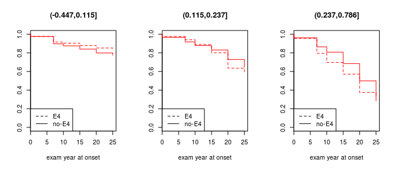

    ## Call:
    ## survdiff(formula = surv2 ~ dfx$apoe4, rho = 1)
    ## 
    ##                   N Observed Expected (O-E)^2/E (O-E)^2/V
    ## dfx$apoe4=E4     68     31.7     26.2     1.139      2.06
    ## dfx$apoe4=no-E4 258    116.8    122.3     0.244      2.06
    ## 
    ##  Chisq= 2.1  on 1 degrees of freedom, p= 0.151

    ## $`(-0.447,0.115]`
    ## Call:
    ## coxph(formula = surv2 ~ relevel(dfx$apoe4, ref = "no-E4") + dfx$age0)
    ## 
    ## 
    ##                                        coef exp(coef) se(coef)     z
    ## relevel(dfx$apoe4, ref = "no-E4")E4 -0.2593    0.7716   0.3114 -0.83
    ## dfx$age0                             0.1454    1.1565   0.0492  2.96
    ##                                          p
    ## relevel(dfx$apoe4, ref = "no-E4")E4 0.4050
    ## dfx$age0                            0.0031
    ## 
    ## Likelihood ratio test=11.2  on 2 df, p=0.00378
    ## n= 325, number of events= 65 
    ## 
    ## $`(0.115,0.237]`
    ## Call:
    ## coxph(formula = surv2 ~ relevel(dfx$apoe4, ref = "no-E4") + dfx$age0)
    ## 
    ## 
    ##                                       coef exp(coef) se(coef)    z      p
    ## relevel(dfx$apoe4, ref = "no-E4")E4 0.2023    1.2243   0.2093 0.97 0.3337
    ## dfx$age0                            0.0994    1.1045   0.0316 3.15 0.0016
    ## 
    ## Likelihood ratio test=11.5  on 2 df, p=0.00322
    ## n= 325, number of events= 112 
    ## 
    ## $`(0.237,0.786]`
    ## Call:
    ## coxph(formula = surv2 ~ relevel(dfx$apoe4, ref = "no-E4") + dfx$age0)
    ## 
    ## 
    ##                                       coef exp(coef) se(coef)    z      p
    ## relevel(dfx$apoe4, ref = "no-E4")E4 0.2192    1.2451   0.1812 1.21 0.2264
    ## dfx$age0                            0.0542    1.0557   0.0201 2.69 0.0071
    ## 
    ## Likelihood ratio test=7.96  on 2 df, p=0.0187
    ## n= 326, number of events= 202

en funcion del CUARTIL de slope de incremento de BMI slopes de los incrementos de BMI

``` r
df1$bmiSlopeCat2=cut(df1$bmiSlope,quantile(df1$bmiSlope,c(0,1/4,2/4,3/4,1),na.rm=T))
table(df1$bmiSlopeCat2,df1$apoe4)
```

    ##                  
    ##                    E4 no-E4
    ##   (-0.447,0.0908]  56   188
    ##   (0.0908,0.168]   67   177
    ##   (0.168,0.275]    61   183
    ##   (0.275,0.786]    51   193

``` r
par(mfrow=c(1,4))
sapply(levels(df1$bmiSlopeCat2),function (x){ 
  dfx=filter(df1,bmiSlopeCat2==x)
  surv2=Surv(dfx$times,dfx$MetS)
  km2=survfit(surv2~dfx$apoe4)##start.time=20,type='kaplan')
  plot(km2,lty=2:1,xlab='exam year at onset',ylim=c(0,1),main=x,mark.time = F)
  d1=survdiff(surv2~dfx$apoe4,rho=1)
  legend('bottomleft',c('E4','no-E4'),lty=2:1)
  print(d1)
  cox=list(coxph(surv2~relevel(dfx$apoe4,ref='no-E4')+dfx$age0))
})
```

    ## Call:
    ## survdiff(formula = surv2 ~ dfx$apoe4, rho = 1)
    ## 
    ##                   N Observed Expected (O-E)^2/E (O-E)^2/V
    ## dfx$apoe4=E4     56     8.44     10.5     0.391     0.577
    ## dfx$apoe4=no-E4 188    36.77     34.7     0.118     0.577
    ## 
    ##  Chisq= 0.6  on 1 degrees of freedom, p= 0.447

    ## Call:
    ## survdiff(formula = surv2 ~ dfx$apoe4, rho = 1)
    ## 
    ##                   N Observed Expected (O-E)^2/E (O-E)^2/V
    ## dfx$apoe4=E4     67     18.7     15.2     0.781      1.25
    ## dfx$apoe4=no-E4 177     37.6     41.0     0.290      1.25
    ## 
    ##  Chisq= 1.3  on 1 degrees of freedom, p= 0.263

    ## Call:
    ## survdiff(formula = surv2 ~ dfx$apoe4, rho = 1)
    ## 
    ##                   N Observed Expected (O-E)^2/E (O-E)^2/V
    ## dfx$apoe4=E4     61     22.2     20.7    0.1005     0.175
    ## dfx$apoe4=no-E4 183     64.7     66.2    0.0315     0.175
    ## 
    ##  Chisq= 0.2  on 1 degrees of freedom, p= 0.676

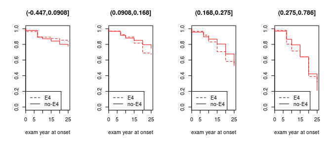

    ## Call:
    ## survdiff(formula = surv2 ~ dfx$apoe4, rho = 1)
    ## 
    ##                   N Observed Expected (O-E)^2/E (O-E)^2/V
    ## dfx$apoe4=E4     51     22.1     21.3   0.02803    0.0535
    ## dfx$apoe4=no-E4 193     93.4     94.2   0.00634    0.0535
    ## 
    ##  Chisq= 0.1  on 1 degrees of freedom, p= 0.817

    ## $`(-0.447,0.0908]`
    ## Call:
    ## coxph(formula = surv2 ~ relevel(dfx$apoe4, ref = "no-E4") + dfx$age0)
    ## 
    ## 
    ##                                        coef exp(coef) se(coef)     z     p
    ## relevel(dfx$apoe4, ref = "no-E4")E4 -0.1922    0.8251   0.3715 -0.52 0.605
    ## dfx$age0                             0.1242    1.1323   0.0548  2.27 0.023
    ## 
    ## Likelihood ratio test=6.37  on 2 df, p=0.0413
    ## n= 244, number of events= 49 
    ## 
    ## $`(0.0908,0.168]`
    ## Call:
    ## coxph(formula = surv2 ~ relevel(dfx$apoe4, ref = "no-E4") + dfx$age0)
    ## 
    ## 
    ##                                       coef exp(coef) se(coef)    z     p
    ## relevel(dfx$apoe4, ref = "no-E4")E4 0.3467    1.4144   0.2680 1.29 0.196
    ## dfx$age0                            0.1124    1.1190   0.0458 2.46 0.014
    ## 
    ## Likelihood ratio test=7.93  on 2 df, p=0.019
    ## n= 244, number of events= 63 
    ## 
    ## $`(0.168,0.275]`
    ## Call:
    ## coxph(formula = surv2 ~ relevel(dfx$apoe4, ref = "no-E4") + dfx$age0)
    ## 
    ## 
    ##                                      coef exp(coef) se(coef)    z       p
    ## relevel(dfx$apoe4, ref = "no-E4")E4 0.062     1.064    0.226 0.27 0.78383
    ## dfx$age0                            0.122     1.130    0.032 3.82 0.00014
    ## 
    ## Likelihood ratio test=15.9  on 2 df, p=0.000356
    ## n= 244, number of events= 106 
    ## 
    ## $`(0.275,0.786]`
    ## Call:
    ## coxph(formula = surv2 ~ relevel(dfx$apoe4, ref = "no-E4") + dfx$age0)
    ## 
    ## 
    ##                                        coef exp(coef) se(coef)     z    p
    ## relevel(dfx$apoe4, ref = "no-E4")E4 -0.0267    0.9736   0.2096 -0.13 0.90
    ## dfx$age0                             0.0351    1.0357   0.0220  1.60 0.11
    ## 
    ## Likelihood ratio test=2.69  on 2 df, p=0.261
    ## n= 244, number of events= 161

Age at onset (toda la poblacion)
--------------------------------

``` r
par(mfrow=c(2,2),las=1)
surv=Surv(df$ageOnset,df$MetS)
km=survfit(surv~df$e4)
#summary(km)
plot(km,lty=3:1,ylim=c(0.3,1),xlim=c(30,55),mark.time = F)
legend('bottomleft',c('00','01','11'),lty=3:1)
plot(km,lty=3:1,ylim=c(0,1),xlim=c(30,55),mark.time = F,fun='cumhaz')
legend('topleft',c('00','01','11'),lty=3:1)
cox=coxph(surv~df$e4)
summary(cox)
```

    ## Call:
    ## coxph(formula = surv ~ df$e4)
    ## 
    ##   n= 3908, number of events= 1337 
    ## 
    ##            coef exp(coef) se(coef)     z Pr(>|z|)  
    ## df$e401 0.12215   1.12993  0.06063 2.015   0.0439 *
    ## df$e411 0.12647   1.13482  0.16558 0.764   0.4450  
    ## ---
    ## Signif. codes:  0 '***' 0.001 '**' 0.01 '*' 0.05 '.' 0.1 ' ' 1
    ## 
    ##         exp(coef) exp(-coef) lower .95 upper .95
    ## df$e401     1.130     0.8850    1.0033     1.273
    ## df$e411     1.135     0.8812    0.8203     1.570
    ## 
    ## Concordance= 0.513  (se = 0.007 )
    ## Rsquare= 0.001   (max possible= 0.995 )
    ## Likelihood ratio test= 4.29  on 2 df,   p=0.117
    ## Wald test            = 4.36  on 2 df,   p=0.1132
    ## Score (logrank) test = 4.36  on 2 df,   p=0.1129

``` r
survdiff(surv~df$e4,rho=0)#rho=0~log-rank or Mantel-Haenszel test
```

    ## Call:
    ## survdiff(formula = surv ~ df$e4, rho = 0)
    ## 
    ##             N Observed Expected (O-E)^2/E (O-E)^2/V
    ## df$e4=00 2725      911    945.4      1.25     4.374
    ## df$e4=01 1081      388    356.9      2.72     3.801
    ## df$e4=11  102       38     34.8      0.30     0.316
    ## 
    ##  Chisq= 4.4  on 2 degrees of freedom, p= 0.112

``` r
km2=survfit(surv~df$apoe4)
plot(km2,lty=2:1,ylim=c(0.3,1),xlim=c(30,55),mark.time = F)
legend('bottomleft',c('E4','no-E4'),lty=2:1)
plot(km2,lty=2:1,ylim=c(0,1),xlim=c(30,55),mark.time = F,fun='cumhaz',las=1)
legend(35,0.8,c('E4','no-E4'),lty=2:1,bty='n')
```

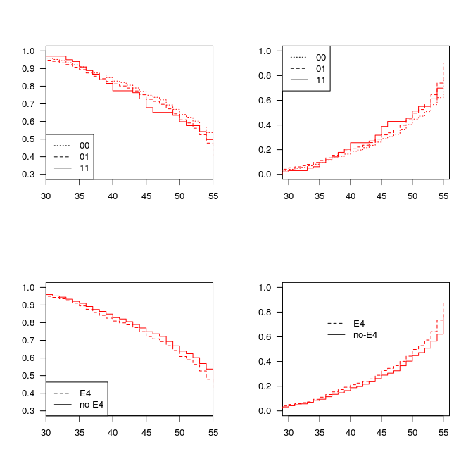

``` r
cox=coxph(surv~df$apoe4)
summary(cox)
```

    ## Call:
    ## coxph(formula = surv ~ df$apoe4)
    ## 
    ##   n= 3908, number of events= 1337 
    ## 
    ##                  coef exp(coef) se(coef)      z Pr(>|z|)  
    ## df$apoe4no-E4 -0.1225    0.8847   0.0587 -2.087   0.0369 *
    ## ---
    ## Signif. codes:  0 '***' 0.001 '**' 0.01 '*' 0.05 '.' 0.1 ' ' 1
    ## 
    ##               exp(coef) exp(-coef) lower .95 upper .95
    ## df$apoe4no-E4    0.8847       1.13    0.7885    0.9925
    ## 
    ## Concordance= 0.513  (se = 0.007 )
    ## Rsquare= 0.001   (max possible= 0.995 )
    ## Likelihood ratio test= 4.29  on 1 df,   p=0.03831
    ## Wald test            = 4.36  on 1 df,   p=0.03685
    ## Score (logrank) test = 4.36  on 1 df,   p=0.03674

``` r
survdiff(surv~df$apoe4,rho=0)#rho=0~log-rank or Mantel-Haenszel test
```

    ## Call:
    ## survdiff(formula = surv ~ df$apoe4, rho = 0)
    ## 
    ##                   N Observed Expected (O-E)^2/E (O-E)^2/V
    ## df$apoe4=E4    1183      426      392      3.01      4.37
    ## df$apoe4=no-E4 2725      911      945      1.25      4.37
    ## 
    ##  Chisq= 4.4  on 1 degrees of freedom, p= 0.0365

``` r
summarise(group_by(df,apoe4),mean_AgeOnset=mean(ageOnset,na.rm = T),median_AgeOnset=median(ageOnset,na.rm = T))
```

    ## Source: local data frame [2 x 3]
    ## 
    ##   apoe4 mean_AgeOnset median_AgeOnset
    ## 1    E4      44.26712              46
    ## 2 no-E4      44.89394              47

En funcion del BMI
------------------

### Toda la poblacion (n=3897)

``` r
df0=filter(df,!is.na(bmi0))
summarise(group_by(df0,MetS,bmi0,apoe4),
          n=sum(!is.na(bmi)),average_BMI=mean(bmi,na.rm=T),median_BMI=median(bmi,na.rm=T))
```

    ## Source: local data frame [12 x 6]
    ## Groups: MetS, bmi0
    ## 
    ##    MetS       bmi0 apoe4    n average_BMI median_BMI
    ## 1     0     Normal    E4  564    25.78531   25.29794
    ## 2     0     Normal no-E4 1448    25.55728   24.99400
    ## 3     0 Overweight    E4  151    31.32152   30.74449
    ## 4     0 Overweight no-E4  293    31.26187   30.27344
    ## 5     0      Obese    E4   38    39.40696   38.00271
    ## 6     0      Obese no-E4   70    37.93391   37.32539
    ## 7     1     Normal    E4  165    30.29373   30.02245
    ## 8     1     Normal no-E4  384    30.22507   29.94785
    ## 9     1 Overweight    E4  146    33.81953   32.68050
    ## 10    1 Overweight no-E4  306    33.95272   33.08016
    ## 11    1      Obese    E4  115    38.48268   37.50856
    ## 12    1      Obese no-E4  217    39.29082   38.35227

Si Solo se incluyrn casos (MetS+)

``` r
par(mfrow=c(1,3))
sapply(levels(df0$bmi0),function (x){ 
  dfx=filter(df0,bmi0==x)
  surv2=Surv(dfx$bmi)
  km2=survfit(surv2~dfx$apoe4)
  plot(km2,lty=2:1,xlim=c(20,41),xlab='BMI at onset',main=x)
  legend('bottomleft',c('E4','no-E4'),lty=2:1)
  cox=list(coxph(surv2~relevel(dfx$apoe4,ref='no-E4')))
})
```

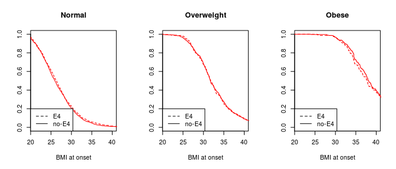

    ## $Normal
    ## Call:
    ## coxph(formula = surv2 ~ relevel(dfx$apoe4, ref = "no-E4"))
    ## 
    ## 
    ##                                        coef exp(coef) se(coef)     z    p
    ## relevel(dfx$apoe4, ref = "no-E4")E4 -0.0589    0.9428   0.0439 -1.34 0.18
    ## 
    ## Likelihood ratio test=1.82  on 1 df, p=0.177
    ## n= 2561, number of events= 2561 
    ## 
    ## $Overweight
    ## Call:
    ## coxph(formula = surv2 ~ relevel(dfx$apoe4, ref = "no-E4"))
    ## 
    ## 
    ##                                       coef exp(coef) se(coef)    z    p
    ## relevel(dfx$apoe4, ref = "no-E4")E4 0.0300    1.0305   0.0711 0.42 0.67
    ## 
    ## Likelihood ratio test=0.18  on 1 df, p=0.673
    ## n= 896, number of events= 896 
    ## 
    ## $Obese
    ## Call:
    ## coxph(formula = surv2 ~ relevel(dfx$apoe4, ref = "no-E4"))
    ## 
    ## 
    ##                                         coef exp(coef) se(coef)     z    p
    ## relevel(dfx$apoe4, ref = "no-E4")E4 -0.00629   0.99373  0.10053 -0.06 0.95
    ## 
    ## Likelihood ratio test=0  on 1 df, p=0.95
    ## n= 440, number of events= 440

Casos y controles

``` r
par(mfrow=c(1,3))

sapply(levels(df0$bmi0),function (x){ #####SURVIVAL CURVE
  dfx=filter(df0,bmi0==x)
  surv2=Surv(round(dfx$bmi,1),dfx$MetS)
  km2=survfit(surv2~dfx$apoe4)##start.time=20,type='kaplan')
  plot(km2,lty=2:1,xlim=c(20,41),xlab='BMI at onset',main=x,mark.time = F)
  legend('bottomleft',c('E4','no-E4'),lty=2:1)
  cox=list(coxph(surv2~relevel(dfx$apoe4,ref='no-E4')))
})
```

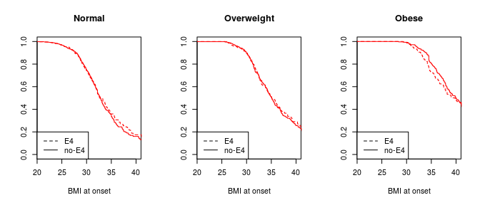

    ## $Normal
    ## Call:
    ## coxph(formula = surv2 ~ relevel(dfx$apoe4, ref = "no-E4"))
    ## 
    ## 
    ##                                        coef exp(coef) se(coef)     z    p
    ## relevel(dfx$apoe4, ref = "no-E4")E4 -0.0288    0.9716   0.0934 -0.31 0.76
    ## 
    ## Likelihood ratio test=0.1  on 1 df, p=0.757
    ## n= 2561, number of events= 549 
    ## 
    ## $Overweight
    ## Call:
    ## coxph(formula = surv2 ~ relevel(dfx$apoe4, ref = "no-E4"))
    ## 
    ## 
    ##                                         coef exp(coef) se(coef)     z    p
    ## relevel(dfx$apoe4, ref = "no-E4")E4 -0.00355   0.99646  0.10076 -0.04 0.97
    ## 
    ## Likelihood ratio test=0  on 1 df, p=0.972
    ## n= 896, number of events= 452 
    ## 
    ## $Obese
    ## Call:
    ## coxph(formula = surv2 ~ relevel(dfx$apoe4, ref = "no-E4"))
    ## 
    ## 
    ##                                        coef exp(coef) se(coef)    z    p
    ## relevel(dfx$apoe4, ref = "no-E4")E4 0.00696   1.00698  0.11560 0.06 0.95
    ## 
    ## Likelihood ratio test=0  on 1 df, p=0.952
    ## n= 440, number of events= 332

``` r
sapply(levels(df0$bmi0),function (x){ #####CUMULATIVE HAZARDs
  dfx=filter(df0,bmi0==x)
  
  surv2=Surv(round(dfx$bmi,1),dfx$MetS)
  km2=survfit(surv2~dfx$apoe4)
  plot(km2,lty=2:1,xlim=c(20,41),xlab='BMI at onset',ylim=c(0,4),main=x,mark.time = F,fun='cumhaz')
  legend('topleft',c('E4','no-E4'),lty=2:1)
  
})
```

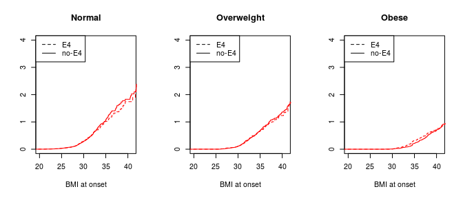

    ##      Normal Overweight Obese 
    ## rect List,4 List,4     List,4
    ## text List,2 List,2     List,2

### Solo varones blancos

``` r
df0=filter(df1,!is.na(bmi0))
summarise(group_by(df0,MetS,bmi0,apoe4),
          n=sum(!is.na(bmi)),average_BMI=mean(bmi,na.rm=T),median_BMI=median(bmi,na.rm=T))
```

    ## Source: local data frame [12 x 6]
    ## Groups: MetS, bmi0
    ## 
    ##    MetS       bmi0 apoe4   n average_BMI median_BMI
    ## 1     0     Normal    E4 122    25.24297   25.00381
    ## 2     0     Normal no-E4 355    25.44872   25.23107
    ## 3     0 Overweight    E4  26    28.60917   27.93440
    ## 4     0 Overweight no-E4  83    29.50871   29.35118
    ## 5     0      Obese    E4   3    38.82897   38.06662
    ## 6     0      Obese no-E4   8    34.33861   33.52371
    ## 7     1     Normal    E4  31    29.03193   28.74022
    ## 8     1     Normal no-E4 134    28.34176   28.60025
    ## 9     1 Overweight    E4  39    31.10446   30.71349
    ## 10    1 Overweight no-E4 128    32.31255   31.62752
    ## 11    1      Obese    E4  15    34.63795   34.50945
    ## 12    1      Obese no-E4  31    35.42406   34.50945

Si Solo se incluyrn casos (MetS+)

``` r
par(mfrow=c(1,3))
sapply(levels(df0$bmi0),function (x){ 
dfx=filter(df0,bmi0==x)
surv2=Surv(dfx$bmi)
km2=survfit(surv2~dfx$apoe4)
plot(km2,lty=2:1,xlim=c(20,41),xlab='BMI at onset',main=x)
legend('bottomleft',c('E4','no-E4'),lty=2:1)
cox=list(coxph(surv2~relevel(dfx$apoe4,ref='no-E4')))
})
```

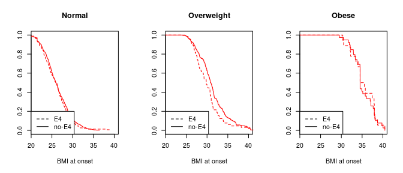

    ## $Normal
    ## Call:
    ## coxph(formula = surv2 ~ relevel(dfx$apoe4, ref = "no-E4"))
    ## 
    ## 
    ##                                       coef exp(coef) se(coef)    z    p
    ## relevel(dfx$apoe4, ref = "no-E4")E4 0.0670    1.0693   0.0934 0.72 0.47
    ## 
    ## Likelihood ratio test=0.51  on 1 df, p=0.476
    ## n= 642, number of events= 642 
    ## 
    ## $Overweight
    ## Call:
    ## coxph(formula = surv2 ~ relevel(dfx$apoe4, ref = "no-E4"))
    ## 
    ## 
    ##                                      coef exp(coef) se(coef)    z    p
    ## relevel(dfx$apoe4, ref = "no-E4")E4 0.332     1.393    0.143 2.32 0.02
    ## 
    ## Likelihood ratio test=5.08  on 1 df, p=0.0242
    ## n= 276, number of events= 276 
    ## 
    ## $Obese
    ## Call:
    ## coxph(formula = surv2 ~ relevel(dfx$apoe4, ref = "no-E4"))
    ## 
    ## 
    ##                                        coef exp(coef) se(coef)     z    p
    ## relevel(dfx$apoe4, ref = "no-E4")E4 -0.0882    0.9156   0.2861 -0.31 0.76
    ## 
    ## Likelihood ratio test=0.1  on 1 df, p=0.757
    ## n= 57, number of events= 57

Casos y controles

``` r
par(mfrow=c(1,3))

sapply(levels(df0$bmi0),function (x){ #####SURVIVAL CURVE
  dfx=filter(df0,bmi0==x)
  surv2=Surv(round(dfx$bmi,1),dfx$MetS)
  km2=survfit(surv2~dfx$apoe4)##start.time=20,type='kaplan')
  plot(km2,lty=2:1,xlim=c(20,41),xlab='BMI at onset',main=x,mark.time = F)
  legend('bottomleft',c('E4','no-E4'),lty=2:1)
  cox=list(coxph(surv2~relevel(dfx$apoe4,ref='no-E4')))
})
```

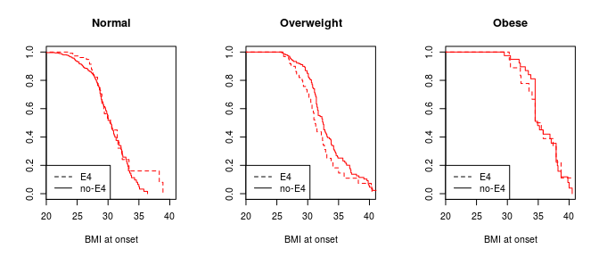

    ## $Normal
    ## Call:
    ## coxph(formula = surv2 ~ relevel(dfx$apoe4, ref = "no-E4"))
    ## 
    ## 
    ##                                       coef exp(coef) se(coef)     z    p
    ## relevel(dfx$apoe4, ref = "no-E4")E4 -0.253     0.777    0.206 -1.22 0.22
    ## 
    ## Likelihood ratio test=1.58  on 1 df, p=0.209
    ## n= 642, number of events= 165 
    ## 
    ## $Overweight
    ## Call:
    ## coxph(formula = surv2 ~ relevel(dfx$apoe4, ref = "no-E4"))
    ## 
    ## 
    ##                                      coef exp(coef) se(coef)    z     p
    ## relevel(dfx$apoe4, ref = "no-E4")E4 0.377     1.458    0.184 2.05 0.041
    ## 
    ## Likelihood ratio test=3.91  on 1 df, p=0.0479
    ## n= 276, number of events= 167 
    ## 
    ## $Obese
    ## Call:
    ## coxph(formula = surv2 ~ relevel(dfx$apoe4, ref = "no-E4"))
    ## 
    ## 
    ##                                        coef exp(coef) se(coef)     z    p
    ## relevel(dfx$apoe4, ref = "no-E4")E4 -0.0493    0.9519   0.3157 -0.16 0.88
    ## 
    ## Likelihood ratio test=0.02  on 1 df, p=0.876
    ## n= 57, number of events= 46

``` r
sapply(levels(df0$bmi0),function (x){ #####CUMULATIVE HAZARDs
  dfx=filter(df0,bmi0==x)
  
  surv2=Surv(round(dfx$bmi,1),dfx$MetS)
  km2=survfit(surv2~dfx$apoe4)
  plot(km2,lty=2:1,xlim=c(20,41),xlab='BMI at onset',ylim=c(0,4),main=x,mark.time = F,fun='cumhaz')
  legend('topleft',c('E4','no-E4'),lty=2:1)
 
})
```

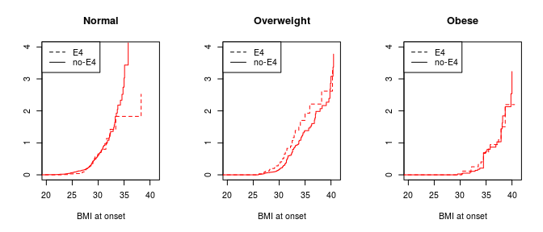

    ##      Normal Overweight Obese 
    ## rect List,4 List,4     List,4
    ## text List,2 List,2     List,2

*si se normaliza Cox con la edad y/o tabaquismo, disminuye la significacion del coeficiente*
